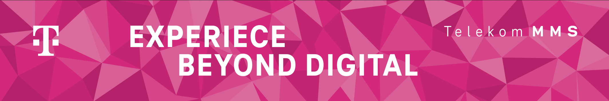

Welcome to our space on GitHub where we house all our open-source projects. Feel free to explore what we have created. If you'd like to contribute or have discovered any issues, don't hesitate to open an issue or pull request (PR).

We are strong proponents of open source! If you're interested in our philosophy, you can find more information in our blog (mostly in German):

* [Wie uns Open Source Software bereichert](https://blog.telekom-mms.com/people-at-mms/wie-uns-open-source-software-bereichert)
* [Open Source Community – Wissen teilen, Ressourcen schonen und Gesellschaft bereichern](https://blog.telekom-mms.com/tech-insights/open-source-community-wissen-teilen-ressourcen-schonen-und-gesellschaft-bereichern)
